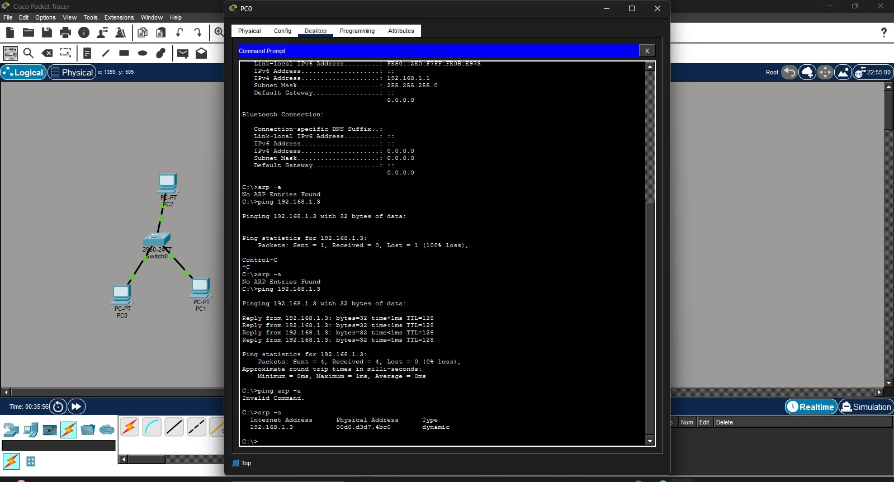

# ARP Visualization in Cisco Packet Tracer

## Overview
A small network build (3 PCs + 1 switch) used to observe ARP (Address Resolution Protocol) behavior in real time — watching how devices resolve IP addresses to MAC addresses before any communication occurs.

## What I Did
- Built a topology of 3 PCs connected through a switch
- Checked the ARP table before sending any traffic (confirmed empty)
- Sent a ping between two devices and observed ARP resolve the destination's MAC address
- Verified the populated ARP table after the ping
- Used Simulation mode to inspect the ARP broadcast packet at Layer 2

## Key Takeaway
ARP is trust-based by design — devices accept the first response without verification. This is the same trust assumption that's exploited in attacks like ARP spoofing/poisoning, making this a useful fundamental for both networking and security work.

## Tools Used
Cisco Packet Tracer (Simulation Mode)

## Screenshots

